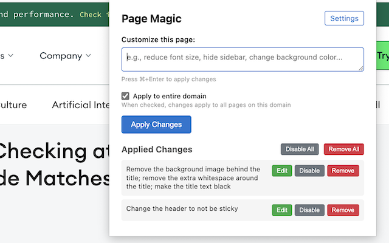
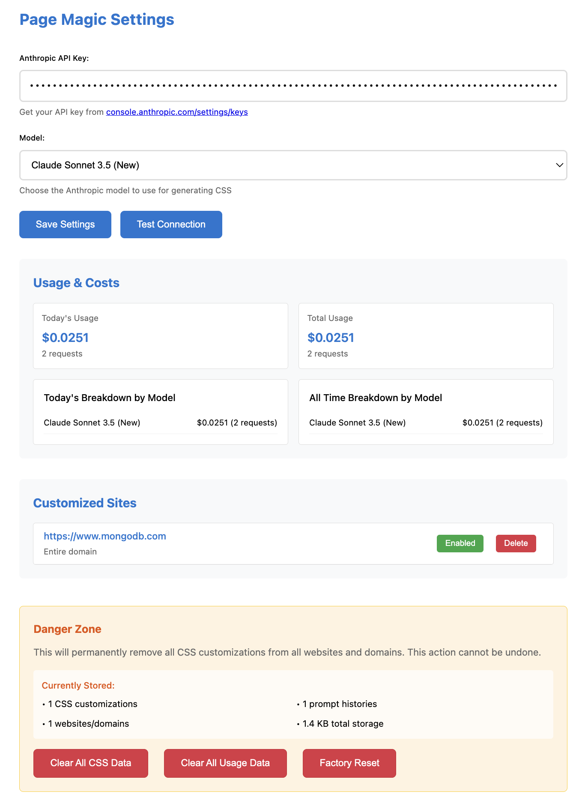

# Page Magic

A Chrome extension that uses AI to customize the appearance of any web page.

> [!NOTE]
> Bring Your Own API Key (BYOK): Page Magic uses the Anthropic API to do all the magic. You will need to provide your own API key to get started.

## Screenshots

Just tell Page Magic what you want to change and it will do it for you.

Add your Anthropic API key to get started, select the model you want to use, and see your API usage cost.

## Installation

You will need node.js installed to build the extension.

1. Clone the repository
2. Run `npm install` to install the dependencies
3. Run `npm run build` to build the extension
4. Open Chrome and go to `chrome://extensions/`
5. Enable Developer Mode
6. Click "Load unpacked" and select the cloned repository
5. You should see **Page Magic** in the list of extensions
6. Click "Options" to configure your settings (you can also do this from the popup)
7. In settings, add your Anthropic API key and select the model you want to use
8. Click "Save" to save your settings

## Usage

1. Open any web page
2. Click the **Page Magic** extension icon
3. Tell Page Magic what you want to change
4. Click "Apply" to apply the changes (it may take a few seconds to complete)

Your changes are applied in an additive manner, so you can apply multiple changes to the same page. You can also disable/enable any single change, or delete all changes.

## License

BSD-3-Clause
